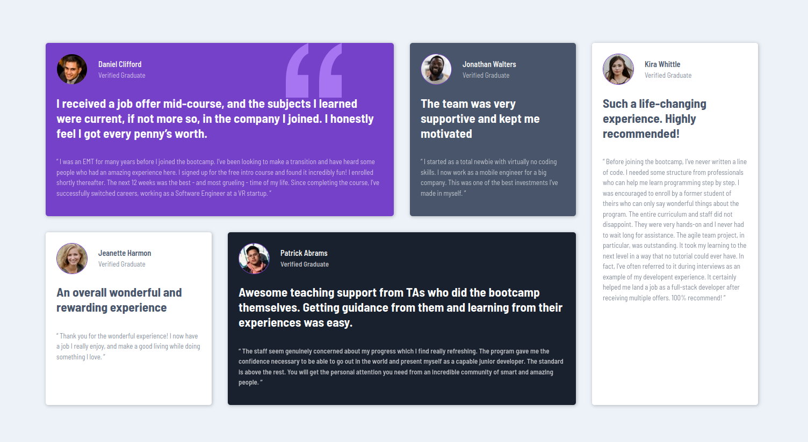

# Frontend Mentor - Testimonials grid section solution

This is a solution to the [Testimonials grid section challenge on Frontend Mentor](https://www.frontendmentor.io/challenges/testimonials-grid-section-Nnw6J7Un7). Frontend Mentor challenges help you improve your coding skills by building realistic projects.

## Table of contents

- [Overview](#overview)
  - [The challenge](#the-challenge)
  - [Screenshot](#screenshot)
  - [Links](#links)
- [My process](#my-process)
  - [Built with](#built-with)
  - [What I learned](#what-i-learned)
  - [Useful resources](#useful-resources)
- [Author](#author)
- [Acknowledgments](#acknowledgments)

## Overview

### The challenge

Users should be able to:

- View the optimal layout for the site depending on their device's screen size

### Screenshot



### Links

- Solution URL: [Repo URL](https://github.com/dungnq271/testimonial-grid-frontend-mentor-challenge-solution)
- Live Site URL: [Live URL](https://dungnq271.github.io/testimonial-grid-frontend-mentor-challenge-solution/)

## My process

### Built with

- Semantic HTML5 markup
- CSS custom properties
- Flexbox
- CSS Grid
- Mobile-first workflow

### What I learned

I consolidated my CSS Flexbox skill by first implementing this design using CSS Flexbox model and later refactoring the code using CSS Grid model myself.

My first use of CSS Grid model to layout the Testimonial grids in desktop view:

```css
#testimonial-grid-container {
  display: grid;
  margin: 0 auto;
  grid-template: repeat(2, 1fr) / repeat(4, 1fr);
  grid-template-areas:
    "t1-alias t1-alias t2-alias t5-alias"
    "t3-alias t4-alias t4-alias t5-alias";
  column-gap: 30px;
  row-gap: 30px;
  max-width: 1440px;
}

#testimonial-1 {
  grid-area: t1-alias;
}

#testimonial-2 {
  grid-area: t2-alias;
}

#testimonial-3 {
  grid-area: t3-alias;
}

#testimonial-4 {
  grid-area: t4-alias;
}

#testimonial-5 {
  grid-area: t5-alias;
}
```

### Useful resources

- [MDN Web Docs](https://developer.mozilla.org/en-US/) - Indispensable resource for web developers. I frequently refer to a lot of other language-specific methods and attributes.

## Author

- Frontend Mentor - [@dungnq271](https://www.frontendmentor.io/profile/dungnq271)
- Twitter - [@LeonardNg27](https://x.com/LeonardNg27)

## Acknowledgments

Inspired from [@zg_dev](https://x.com/zg_dev)'s [Frontend Web Development Bootcamp Course](https://www.youtube.com/watch?v=zJSY8tbf_ys) and his [CSS Grid Course](https://www.youtube.com/watch?v=BIx3XdHA8-Y)
